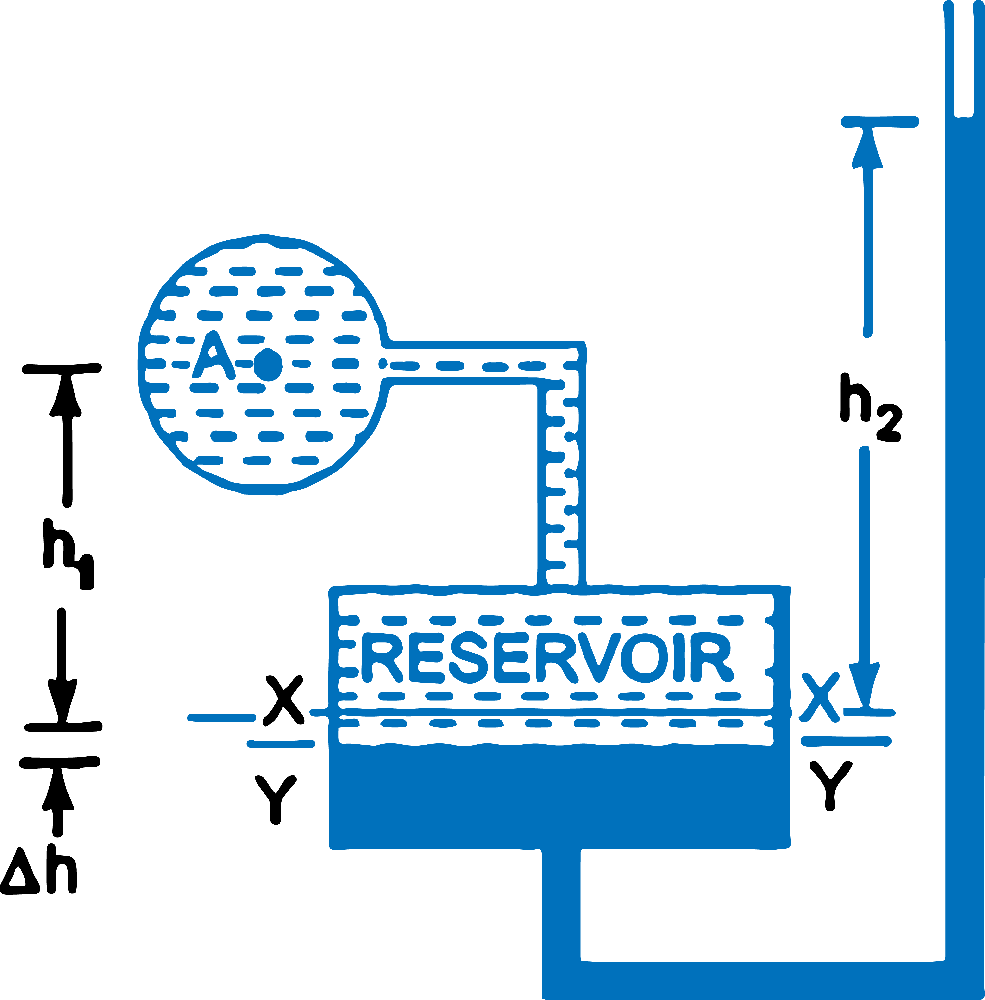
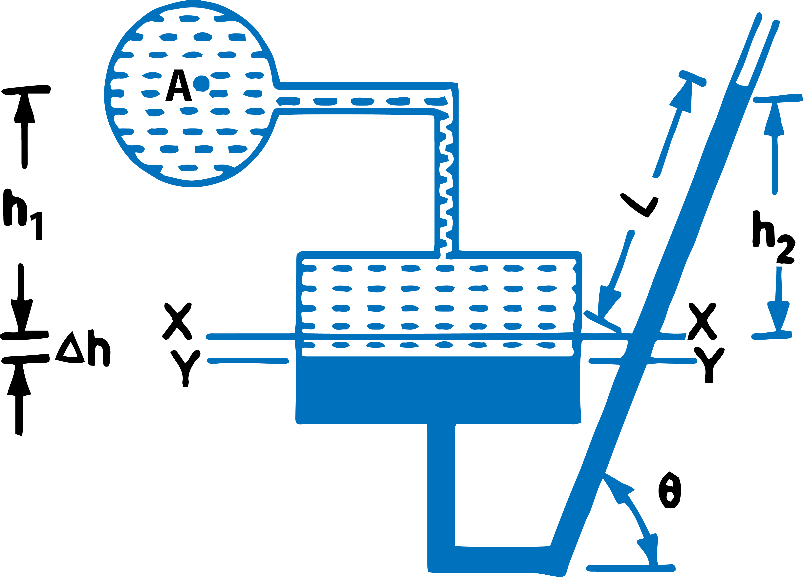

<h2>Single Column Manometer</h2>

Single column manometer is a modified form of a U-tube manometer in which a reservoir, having a large cross-sectional area (about 100 times) as compared to the area of the tube is connected to one of the limbs (say left limb) of the manometer as shown in Fig. 1. Due to large cross-sectional area of the reservoir, for any variation in pressure, the change in the liquid level in the reservoir will be very small which may be neglected and hence the pressure is given by the height of liquid in the other limb. The other limb may be vertical or inclined. Thus there are two types of single column manometer as
   <ol>
      <li>Vertical Single Column Manometer</li>
      <li>Inclined Single Column Manometer</li>
   </ol>

<h3> 1. Vertical Single Column Manometer</h3>
 

$$ Fig.\ 1.\ Vertical\ \ Single\ \ Column\ \ Manometer  $$

 

Fig.1. shows the vertical single column manometer. Let X-X be the datum line in the reservoir and in the right limb of the manometer, when it is not connected to the pipe. When the manometer is connected to the pipe, due to high pressure at A, the heavy liquid in the reservoir will be pushed downward and will rise in the right limb.   
Let,

$$Δh = Fall\ of\ heavy\ liquid\ in\ reservoir $$
$$ h_2 = Rise\ of\ heavy\ liquid\ in\ right\ limb\ $$
$$ h_1 = Height\ of\ centre\ of\ pipe\ above\ X-X $$
$$ p_A = Pressure\ at\ A,\ which\ is\ to\ be\ measured $$
$$ A = Cross-sectional\ area\ of\ the\ reservoir $$
$$ a = Cross-sectional\ area\ of\ the\ right\ limb $$
$$S_1 = Sp.\ gr.\ of\ liquid\ in\ pipe$$
$$ S_2 = Sp.\ gr.\ of\ heavy\ liquid\ in\ reservoir\ and\ right\ limb $$
$$ \rho_1 = Density\ of\ liquid\ in\ pipe $$
$$ \rho_2 = Density\ of\ liquid\ in\ reservoir $$

 

Fall of heavy liquid in reservoir will cause a rise of heavy liquid level in the right limb.

$$ ∴ \qquad \qquad A × Δh = a × h_2 $$
$$ ∴ \qquad \qquad Δh = \frac{a × h_2}{A} \qquad \qquad \qquad ...equ(1) $$

Now consider the datum line Y-Y as shown in Fig.1. Then pressure in the right limb above Y-Y.

$$ = \rho_2 × g × (Δh + h_2) $$
$$ Pressure\ in\ the\ left\ limb\ above\ Y-Y = \rho_1 × g × (Δh + h_1) + p_A $$

Equating these pressures, we have

$$\rho_2 × g × (Δh + h_2) = \rho_1 × g × (Δh + h_1) + p_A$$
$$ p_A = \rho_2g(Δh + h_2) - \rho_1g(Δh + h_1) $$
$$ p_A = Δh[\rho_2g - \rho_1g] + h_2\rho_2g - h_1\rho_1g $$

But from equation (1),

$$ Δh = \frac{a \times h_2}{A} $$
$$ ∴ \qquad \qquad p_A = \frac{a \times h_2}{A}[\rho_2g - \rho_1g] + h_2\rho_2g- h_1\rho_1g \qquad \qquad \qquad ...equ(2) $$

As the area A is very large as compared to a, hence ratio a/A becomes very small and can be neglected.

$$ Then \qquad p_A = h_2\rho_2g  - h_1\rho_1g \qquad \qquad \qquad ...equ(3) $$

From equation (3), it is clear that as h1 is known and hence by knowing h2 or rise of heavy liquid in the right limb, the pressure at A can be calculated.

<h3> 2. Inclined Single Column Manometer</h3>
 

$$ Fig.\ 2.\ Inclined\ \ Single\ \ Column\ \ Manometer  $$

 

Fig. 2 shows the inclined single column manometer. This manometer is more sensitive. Due to inclination the distance moved by the heavy liquid in the right limb will be more.

Let

&emsp; &emsp; L = Length of heavy liquid moved in right limb from X-X 
 
&emsp; &emsp; &theta; = Inclination of right limb with horizontal
 
&emsp; &emsp; h2 = Vertical rise of heavy liquid in right limb from X-X= L &times; sin &theta;

From equation (3), the pressure at A is

$$ p_A = h_2\rho_2g - h_1\rho_1g $$

Substituting the value of h2 , we get

$$p_A = sin θ × \rho_2g - h_1\rho_1g \qquad \qquad \qquad ...equ(4)$$